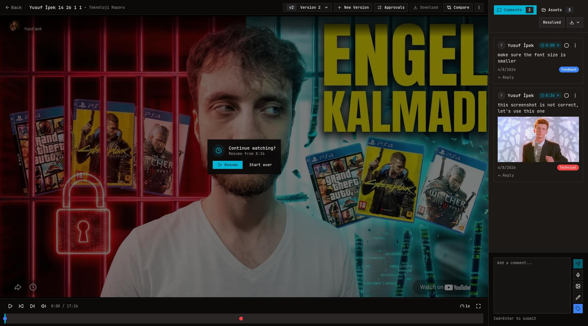

# OpenFrame

OpenFrame is a fair source video review and approval platform for teams that need clear feedback, version control, and client-friendly review links in one place. It supports collaborative review workflows out of the box and can be self-hosted with the Docker setup included in this repository.

Prefer not to self-host? You can try OpenFrame at [open-frame.net](https://open-frame.net) with a 7-day free trial, then continue on the hosted plan starting at $10.

## Product Screenshot



## What OpenFrame Covers

OpenFrame is built for video teams that want one system for review, revision, approval, and delivery feedback.

- Timestamped comments directly on the video timeline
- Voice notes, image attachments, and frame annotations
- Version history with side-by-side compare
- Approval requests and sign-off tracking
- Share links for client review with optional guest commenting
- Workspaces, projects, member roles, and invitation flows
- Comment tags, resolved states, and CSV/PDF exports
- Video-linked assets for supporting media and references
- Email and Telegram notifications
- URL-based YouTube video intake plus optional Bunny direct uploads

## Core Workflow

1. Add a video to a project from a YouTube URL or direct upload flow.
2. Share a review link with internal collaborators or external stakeholders.
3. Collect timestamped feedback with text, voice, images, and annotations.
4. Compare versions, resolve comments, and request approvals.
5. Export feedback or keep everything tracked inside the project timeline.

## Features

### Review Without Guesswork

- Timestamped comments anchor every note to an exact moment in the cut.
- Reviewers can leave text, voice notes, image attachments, and drawn annotations.
- Comment threads support replies, resolution states, and project-specific tags.

### Versioning And Comparison

- Videos support multiple versions inside the same review thread.
- Teams can switch between versions without losing review context.
- Compare mode lets reviewers inspect two versions side by side.

### Client And Team Collaboration

- Share links can be configured for view or comment access.
- Guest review is supported for external stakeholders.
- Workspaces and projects support member roles, invitations, and scoped access.

### Approval And Reporting

- Approval requests can be sent to specific reviewers.
- Approval decisions are tracked per request with pending, approved, rejected, and canceled states.
- Comments can be exported as CSV or PDF for offline review and handoff.

### Assets, Notifications, And Integrations

- Videos can include related assets such as images, supplementary videos, and audio.
- Notification settings support email and Telegram delivery.
- Self-hosted setups can run with bundled S3-compatible storage or external object storage.
- Optional integrations include Stripe billing, Bunny direct uploads, OAuth providers, SMTP, and Telegram notifications.

## Stack

OpenFrame is built with:

- Next.js 16 and React 19
- Bun
- TypeScript
- Prisma
- PostgreSQL
- NextAuth.js
- Tailwind CSS
- MinIO or other S3-compatible object storage for self-hosted media
- Bunny Stream for optional direct video uploads

## Self-Hosting

OpenFrame ships with a Docker Compose setup for self-hosting. The default stack brings up:

- OpenFrame on `http://localhost:3000`
- PostgreSQL for the application database
- MinIO for S3-compatible object storage

### Quick Start

```bash
cp .env.docker.example .env.docker
```

Edit `.env.docker`, set strong values for `NEXTAUTH_SECRET`, `POSTGRES_PASSWORD`, and the MinIO credentials, then start the stack:

```bash
docker compose up --build
```

Open `http://localhost:3000` after the containers become healthy.

MinIO is bound to `127.0.0.1` by default, so the S3 API and admin console stay local to the host unless you intentionally re-publish those ports.

The Docker template already trusts `localhost:3000` for Auth.js via `AUTH_TRUST_HOST=true`, so the default local Compose flow does not require extra auth host setup.

### First Boot Behavior

- The app waits for PostgreSQL and MinIO before starting.
- Prisma migrations run automatically on container boot.
- The MinIO bucket is created automatically when `SELF_HOSTED_AUTO_CREATE_BUCKET=true`.

### Persistence And Upgrades

- PostgreSQL data is stored in the `postgres-data` Docker volume.
- MinIO objects are stored in the `minio-data` Docker volume.
- After updating the repo, rebuild and restart with `docker compose up --build`.

### Optional Integrations And Feature Flags

The Docker example disables hosted-only features by default:

```bash
OPENFRAME_ENABLE_STRIPE=false
OPENFRAME_ENABLE_BUNNY_UPLOADS=false
OPENFRAME_REQUIRE_INVITE_CODE=false
```

Behavior when disabled:

- `OPENFRAME_ENABLE_STRIPE=false` disables Stripe checkout and customer portal flows and removes billing-based workspace restrictions.
- `OPENFRAME_ENABLE_BUNNY_UPLOADS=false` hides direct-upload entry points. URL-based providers such as YouTube remain available.
- `OPENFRAME_REQUIRE_INVITE_CODE=false` allows open registration while keeping invitation-link registration intact.

These integrations remain optional for self-hosted deployments and can be enabled later by setting the related environment variables:

- Stripe billing
- Bunny direct uploads
- SMTP for invitation and notification delivery
- Telegram notifications
- External S3-compatible storage such as Cloudflare R2 or another compatible provider instead of bundled MinIO
- Google and GitHub OAuth

## Development

Install dependencies and run validation with Bun:

```bash
bun install
bun run check
```

Feature flags and self-hosting environment variables are documented in `.env.example` and `.env.docker.example`.

## Contributing

Contributions are welcome.

- Read [CONTRIBUTING.md](CONTRIBUTING.md) for workflow, conventions, and PR requirements.
- Use [SECURITY.md](SECURITY.md) for responsible vulnerability reporting.
- Follow [CODE_OF_CONDUCT.md](CODE_OF_CONDUCT.md) in all project interactions.
